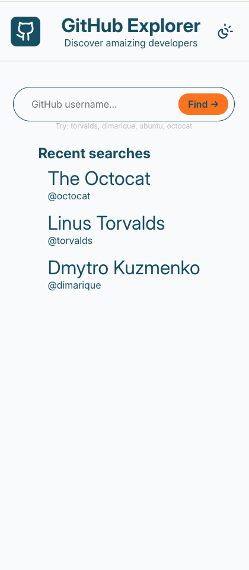
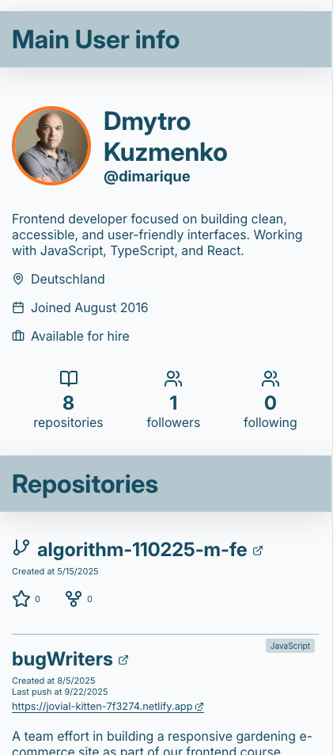
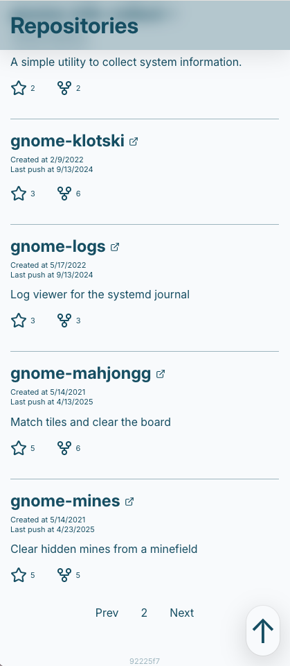

# 🔍 GitHub Explorer

A web application for searching GitHub users and browsing their repositories. Built with React 19, TypeScript, and the GitHub REST API.



## ✨ Features

- **User search** — enter a GitHub username to fetch their public profile and repositories
- **User profile card** — displays avatar, name, bio, location, blog link, join date, and "available for hire" status
- **Stats overview** — shows public repository count, followers, and following
- **Repository list** — paginated list of repos (30 per page) with name, description, language badge, star and fork counts, creation date, and last push date
- **Repo metadata** — forked and archived repos are visually marked; homepage links are shown when available
- **Pagination** — navigate between pages of repositories with Prev/Next buttons
- **Recent searches** — the last 5 searched users are saved to `localStorage` and shown on the start screen for quick re-access
- **Light / dark theme** — toggle between themes; preference is persisted in `localStorage`
- **Scroll-to-top button** — appears after scrolling down 300px
- **Error handling** — displays a message if the user is not found or the request fails

## 📸 Screenshots

### Light Theme


### Dark Theme


### User Profile



### Repository List



## 🛠️ Built With

- **React 19** — UI library
- **TypeScript** — type safety throughout, with types from `@octokit/openapi-types`
- **CSS Modules** — component-scoped styles
- **GitHub REST API** — data source (no authentication required)
- **Lucide React** — icons
- **Vite** — build tool

## 📦 Installation

```bash
# Clone the repository
git clone https://github.com/yourusername/github-explorer.git

# Navigate to project directory
cd github-explorer

# Install dependencies
npm install

# Start development server
npm run dev
```

## 🗂️ Project Structure

```
src/
├── components/
│   ├── Header/          # Logo, title, theme toggle
│   ├── search/          # SearchField, SearchInput, SearchButton
│   ├── MainInfo/        # User profile card
│   ├── RepoList/        # Repository list
│   ├── RepoListItem/    # Single repository card
│   ├── Navigation/      # Prev/Next pagination
│   ├── RecentsList/     # Recent searches list
│   ├── GoUpButton/      # Scroll-to-top button
│   ├── ContentWrapper/  # Layout wrapper for profile + repos
│   └── Footer/
├── hooks/
│   ├── useUserInfo.tsx       # Fetches user profile
│   └── useUserReposList.tsx  # Fetches paginated repo list
└── types.ts
```

## 👤 Author

**Dmytro Kuzmenko**

- GitHub: [@yourusername](https://github.com/yourusername)
- LinkedIn: [linkedin.com/in/yourprofile](https://linkedin.com/in/yourprofile)
